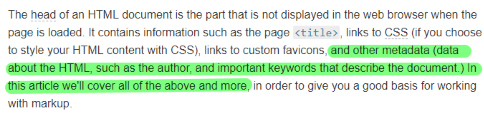

<!-- TOC -->

- [What is the HTML head?](#what-is-the-html-head)
  - [Adding custom icons to your site](#adding-custom-icons-to-your-site)
  - [Applying CSS and JavaScript to HTML](#applying-css-and-javascript-to-html)
  - [HTML text fundamentals](#html-text-fundamentals)

<!-- /TOC -->


## What is the HTML head?


### Adding custom icons to your site

### Applying CSS and JavaScript to HTML

### HTML text fundamentals
  

```html
<span style="font-size: 32px; margin: 21px 0; display: block;">Is this a top level heading?</span>
```

*span*


